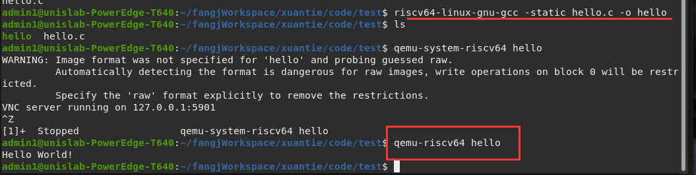

[TOC]

## Qemu 简介

## Qemu 安装

### 编译运行：Hello World
1.编写代码

```c
#include <stdio.h>

int main(void)
{
	printf("Hello World!\n");
	return 0;
}
```

2.生成可执行文件
   - 使用riscv的gcc交叉编译器在x86生成riscv的可执行文件。
   - 需要添加  `-static`编译选项。表示使用静态链接
   >riscv64-linux-gnu-gcc -static hello.c -o hello

3.执行
   - qemu-system-riscv64 对应system mode
   - qemu-riscv64 对应user mode
   - 这里应该使用user模式
   <!-- >qemu-riscv64 hello -->
    
