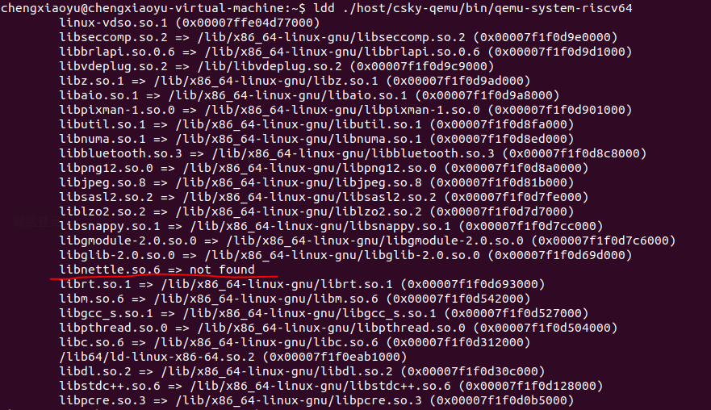

## 搭建qemu验证环境

**参考的是c9xx linux-5.10 的 readme.txt -> Quick Start for qemu run 章节:**
https://github.com/c-sky/buildroot/releases/tag/v1.0.10.1

### 调试日记

1. **缺失库**\

    在运行这一行指令时
     >LD_LIBRARY_PATH=./host/lib ./host/csky-qemu/bin/qemu-system-riscv64 -M virt -kernel fw_jump.elf -device loader,file=Image,addr=0x80200000 -append "rootwait root=/dev/vda ro" -drive file=rootfs.ext2,format=raw,id=hd0 -device virtio-blk-device,drive=hd0 -nographic -smp 1\
    
     会出现如下报错

     

   文档里给的是基于Ubuntu16.04的，我使用的是Ubuntu20.04所以在安装前要查看缺失的库；
   
   
   **解决方案**

   1. 从https://ftp.gnu.org/gnu/nettle/ 下载源码（我下载的是3.2版本的可以用）

   2. 执行 ./configure && make -j 4

   3. 直接将编译出来的动态链接库libnettle.so 重命名为之前not found的 libnettle.so.6 后移动到usr/lib

     