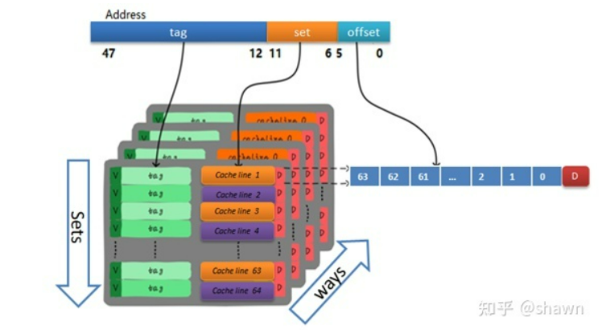

## 需要解决的问题
1、Cache冲刷问题

玄铁C910采用物理地址索引，物理地址标记(PIPT)。`因此首先需要将虚拟地址转换为物理地址，再根据物理地址去访问Cache`。代码需要改动

2、分支预测器训练


## 一、Xuantie C910 L1 Dcache
- 大小为64KB，2 路组相联，缓存行大小为64B；
- 物理地址索引，物理地址标记(PIPT)；
- 写策略支持写回-写分配模式和写回-写不分配模式；
- 采用先进先出的替换策略；
- 支持对整个数据高速缓存的无效和清除操作，支持对单条缓存行的无效和清除操作；（用户模式下不可用）
- 支持数据预取


## 二、Cache冲刷策略概述

RISC-V CPU的指令集还不支持对cache line的直接操作（x86有clflush），需要其他方法来实现与clflush操作相同的效果，比如我们可以通过往cache中的指定位置加载新的垃圾内容，对原有的本来想刷新的内容进行覆盖(本质上是cache中的tag改变)，从而变相地实现对cache指定地址的flush等效操作。

举个极端的例子，如果你知道整个Cache有64KB，那么你加载64KB大小的随机内存数据（垃圾数据）到一个数组中，则这些数据就会被同时加载到data Cache中，因为Cache只有64KB大小，这时Cache中原本的所有数据会被冲走，我们采用的方法类似，但只flush我们关心的cache行，而不是整个cache。



Cache查找的策略是，根据set（idx)位锁定所在行，并于该行中的n路（Ways)的tag进行比较。如果有相同的，则表示cache `hit`。否则Cache `miss`。
因此，只需要访问相同idx，但是不同tag地址的数据就可以将原有的cache line驱逐出去。


```c
/* ----------------------------------
 * |                  Cache address |
 * ----------------------------------
 * |       tag |      idx |  offset |
 * ----------------------------------
 * | 63 <-> 15 | 14 <-> 6 | 5 <-> 0 |
 * ----------------------------------
 */
```

## 三、代码
理解可能存在有误的情况，请及时指正。
### 1、宏定义
修改inc/cache.h中的相关宏定义，以适用于Xuantie C910。
已知L1 Dcache的参数如下：

|  参数   | 术语  |   数值  |
|  ----  | ----  |  ----  |
| 缓存行大小 | Cache line  | 64B | 
| 缓存行数目 | Sets        | 512 |
| 路数      |Ways          | 2 |  

```c
//cache line 是cache和主存之间传输的最小单位
#define L1_BLOCK_SZ_BYTES 64
#define L1_BLOCK_BITS 6 // note: this is log2Ceil(L1_BLOCK_SZ_BYTES)

//512行 cache line
#define L1_SETS 512
#define L1_SET_BITS 9 // note: this is log2Ceil(L1_SETS)

//路（Ways）
#define L1_WAYS 2
```

### 2、变量解析


请对照具体源码
|变量 | 含义|
|----|----|
|dummyMem | 存放脏数据的数组|
|numSetsClear|需要清除的缓存行的个数|
|alignedMem| dummyMeme[L1_SIZE_BYTES]处地址的tag值|
|setOffset|set值（idx)|
|wayOffset||


## 参考网址
[RISC-V CPU侧信道攻击原理与实践（4）-- Cache测量](https://zhuanlan.zhihu.com/p/393799166)