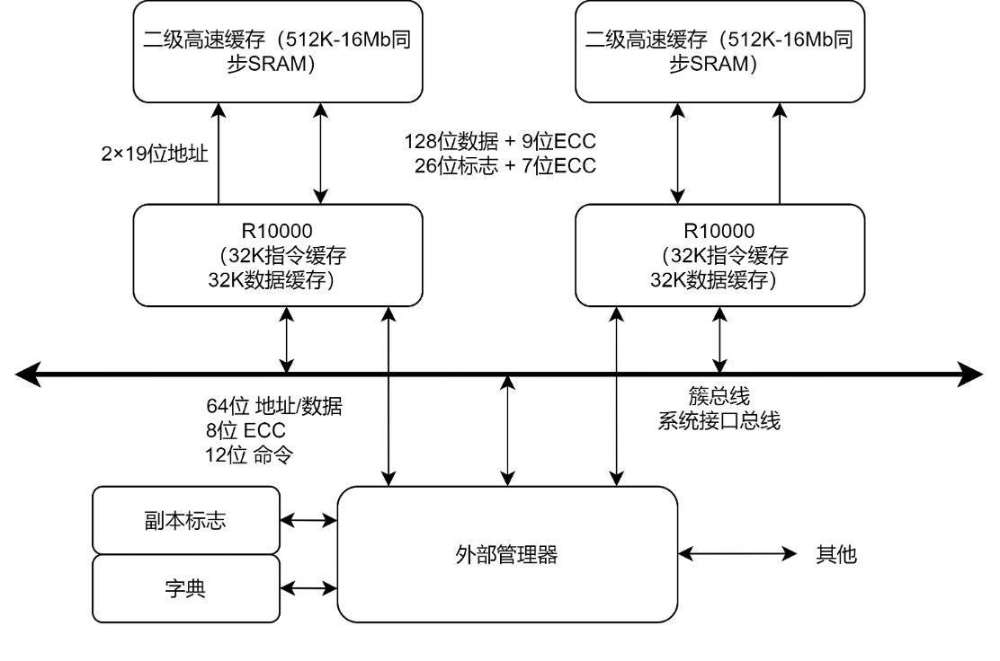
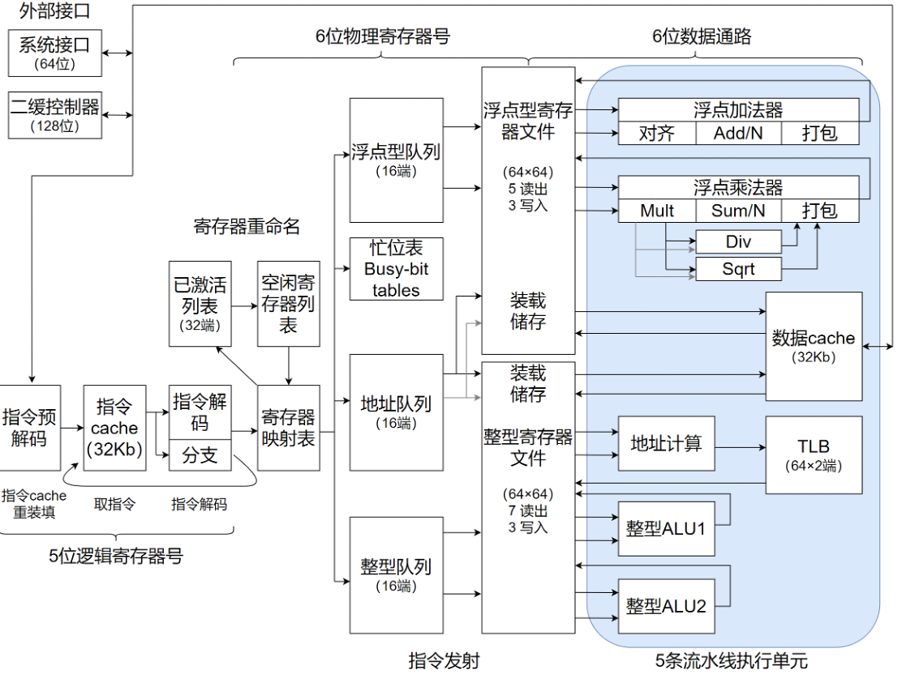
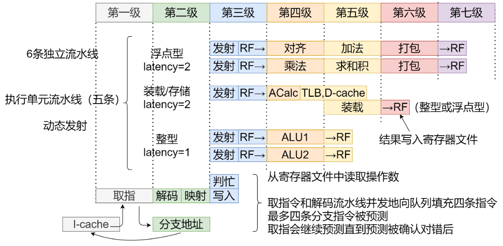
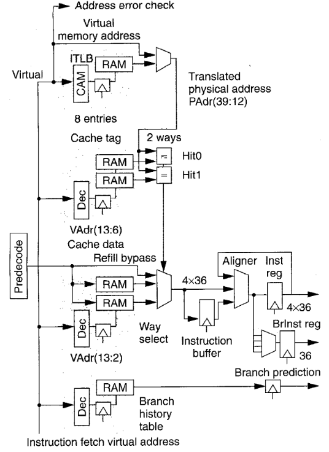
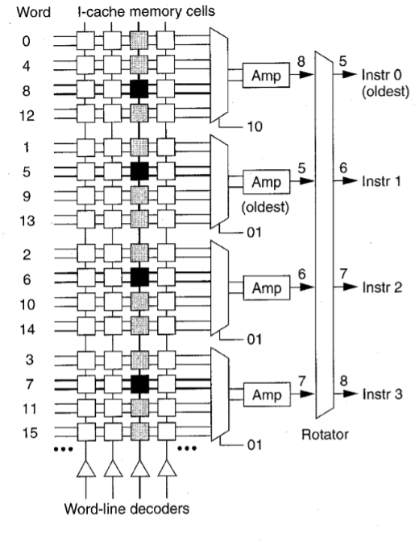

# 超标量乱序处理器始祖：MIPS R10000

> 再次看到R10k，已经是23年的5月份了。回想起硕士刚进课题组调研BOOM的时候，观察到了UCB的团队给予了该处理器崇高的敬意，宣称R10k给BOOM的设计开发工作提供了许多灵感。当初在几乎一片空白的知识体系下翻译了这篇论文，有很多谬误和不专业的地方恳请各位看官原谅！ 借此整理博客的机会，把之前的文字也重新整理，（有些当时绘制的图已经找不到了）回顾一下这颗古老的，跨时代设计的艺术品。

> Reference: 
> Yeager, Kenneth C. "The MIPS R10000 superscalar microprocessor." IEEE micro 16.2 (1996): 
28-41.

## 处理器总览

* 四路超标量 RISC 处理器
    * 每周期取指并译码四条指令
    * 基于分支预测的推测执行技术，4-entry的分支栈
    * 动态乱序执行技术
    * 利用映射表实现寄存器重命名
    * in-order graduation for precise exceptions
* 五条独立的流水线执行单元
    * 一个非阻塞 Load/Store 单元
    * 64位整形 ALU * 2
    * 64位 IEEE 754-1985 FPU
    * 2-cycle 流水线加法器
    * 2-cycle 流水线乘法器
* 层次化、非阻塞的内存子系统
    * 片内、2-way L1缓存
        * 32Kb Icache
        * 32Kb Interleaved Dcache
    * 片外、2-way L2缓存
        * 128bit-wide, 同步SRAM
    * 64bit 多核系统接口(带分离事务协议)

## 系统灵活性

通过不同的配置，R10k可以在一个宽范围系统中工作——单核处理器或多核处理器（集群）。系统使用snoopy或[directory](https://zhuanlan.zhihu.com/p/419722803)方案来维护缓存一致性。R10k的L2缓存范围在512K字节到16M字节之间。

## 概述

两张图为R10k的组成框图和流水线时序图，共有近6条独立流水线。

取指流水线位于第1至3级，在第1级R10k获取并对齐后续四条指令；在第2级，进行译码并对齐后续四条指令，在第2级，进行译码并对这些指令进行重命名，还对其中的跳转和分支指令计算目标地址。在第3级，将重命名后的指令写入队列。同时读取忙位表（busy-bit table）来判断。

操作数是否处于忙状态，指令将在队列中等待直到其所有操作数就绪。

在第三级，当队列发射一条指令，则其后的五条执行流水线就开动了。处理器在第3级的后半段从寄存器文件中读取操作数，并从第4级开始执行，整数流水线占据一级，装载流水线占据两级，浮点流水线占据三级，处理器在下一级前半段将结果写入寄存器文件。

整数和浮点部分有不同的指令队列、寄存器文件和数据通道。分离是为了减少最大线长（wire length），获得完全的并行操作。分开后的两个寄存器文件比组合在一个单元里需要更多的空闲寄存器。但由于每个寄存器只需要少量读写端口，因此，物理上来说面积会更小。

> 图中“发射”为 Issue Queue

## 取指级

为了获得更好的性能，处理器需要用比执行更高的带宽来取指和译码，将指令队列保持满载很重要。这样才能提前找到（look ahead）可乱序发射的指令。最终处理器获取到比执行指令数还多的指令，因为在误判分支（mispredicted branch）后会需要放弃部分指令。

