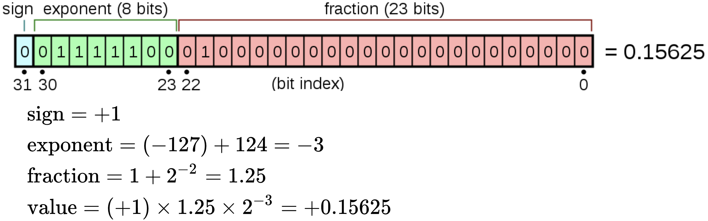

 


# 漫谈单精度浮点数、定点数与硬件实现

## 单精度浮点数格式

> 单精度浮点数格式是一种数据类型，在计算机存储器中占用4个字节（32 bits），利用“浮点”（浮动小数点）的方法，可以表示一个范围很大的数值。<br>
> IEEE 754-1985 **single**<br>
> IEEE 754-2008 **binary32**

第1位表示正负，中间8位表示指数，后23位储存有效数位（有效数位是24位）



* 第一位的正负号0代表正，1代表负
* 中间八位共可表示28=256个数，指数可以是二补码；或0到255，0到126代表-127到-1，127代表零，128-255代表1-128
* 有效数位最左手边的1并不会储存，因为它一定存在（二进制的第一个有效数字必定是1）。换言之，有效数位是24位，实际储存23位


## 定点数格式

定点数由若干位整数和若干位小数组成。其值= **该二进制码对应的整数补码** 除以 **2^小数位数** 。

例如，若整数位数为8，小数位数为8，举例如下表：

|     二进制码     | 整数补码 | 定点数值 (8位整数，8位小数) |   备注   |
| :--------------: | :------: | :-------------------------: | :------: |
| 0000000000000000 |    0     |             0.0             |   零值   |
| 0000000100000000 |   256    |             1.0             |          |
| 1111111100000000 |   -256   |            -1.0             |          |
| 0000000000000001 |    1     |         0.00390625          | 正最小值 |
| 1111111111111111 |    -1    |         -0.00390625         | 负最大值 |
| 0111111111111111 |  32767   |        127.99609375         | 正最大值 |
| 1000000000000000 |  -32768  |           -128.0            | 负最小值 |
| 0001010111000011 |   5571   |         21.76171875         |          |
| 1001010110100110 |  -27226  |        -106.3515625         |          |

## Verilog-FixedPoint

SystemVerilog 定点数库

* 可定制整数位宽和小数位宽。
* **运算** ： 加、减、乘、除、开方。
* **溢出检测** ： 发生溢出时，溢出信号=1，输出结果会设为正最大值（上溢出）或负最小值（下溢出）。
* **舍入控制** ： 发生截断时，可选择是否进行四舍五入。
* **与单精度浮点数（IEEE754）互相转换** 。
* 所有运算均有 **单周期实现** ，组合逻辑延迟长的运算有 **流水线实现** 。

本库的模块输入输出都可以用参数 (parameter) 来定制定点数位宽，这些参数的命名是统一的：

- WOI 和 WOF 分别是输出的定点数的整数位宽和小数位宽。
- 对于单目运算， WII 和 WIF 分别是输入的定点数的整数位宽和小数位宽。
- 对于双目运算， WIIA 和 WIFA 分别是输入操作数A的定点数的整数位宽和小数位宽；WIIB 和 WIFB 分别是输入操作数B的定点数的整数位宽和小数位宽。

以乘法器为例：

```Verilog
module fxp_mul #( // 以乘法器为例
    parameter WIIA = 8,       // 输入(乘数a)的整数位宽，默认=8
    parameter WIFA = 8,       // 输入(乘数a)的小数位宽，默认=8
    parameter WIIB = 8,       // 输入(乘数b)的整数位宽，默认=8
    parameter WIFB = 8,       // 输入(乘数b)的小数位宽，默认=8
    parameter WOI  = 8,       // 输出(积)的整数位宽，默认=8
    parameter WOF  = 8,       // 输出(积)的小数位宽，默认=8
    parameter bit ROUND= 1    // 当积的小数截断时，是否四舍五入，默认是
)(
    input  wire [WIIA+WIFA-1:0] ina, // 乘数a
    input  wire [WIIB+WIFB-1:0] inb, // 乘数b
    output wire [WOI +WOF -1:0] out, // 结果(积) = 乘数a * 乘数b
    output wire overflow             // 结果是否溢出，若溢出则为 1'b1
                                     // 若为上溢出，则out被置为最大正值
                                     // 若为下溢出，则out被置为最小负值
);
```


## 各模块名称与功能


<!-- ### 矩阵处理器


PULP平台没有设计矩阵处理单元<br>
AI处理器的矩阵处理单元专用于专用于**矩阵乘法**和**卷积运算**


脉动阵列是用于实现矩阵处理器最为常见的微架构，它本身的数学原理其实非常简单。<br>为了将脉动阵列应用于不同场景（经典场景：**矩阵乘法、卷积**），理解其数据流是关键。<br>理解了数据流，那么微架构的设计就呼之欲出、顺理成章了。 -->